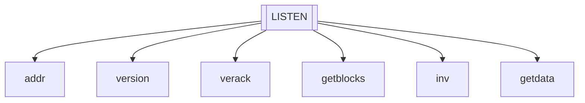
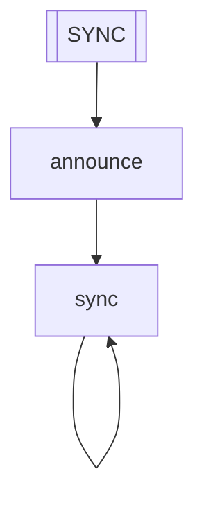
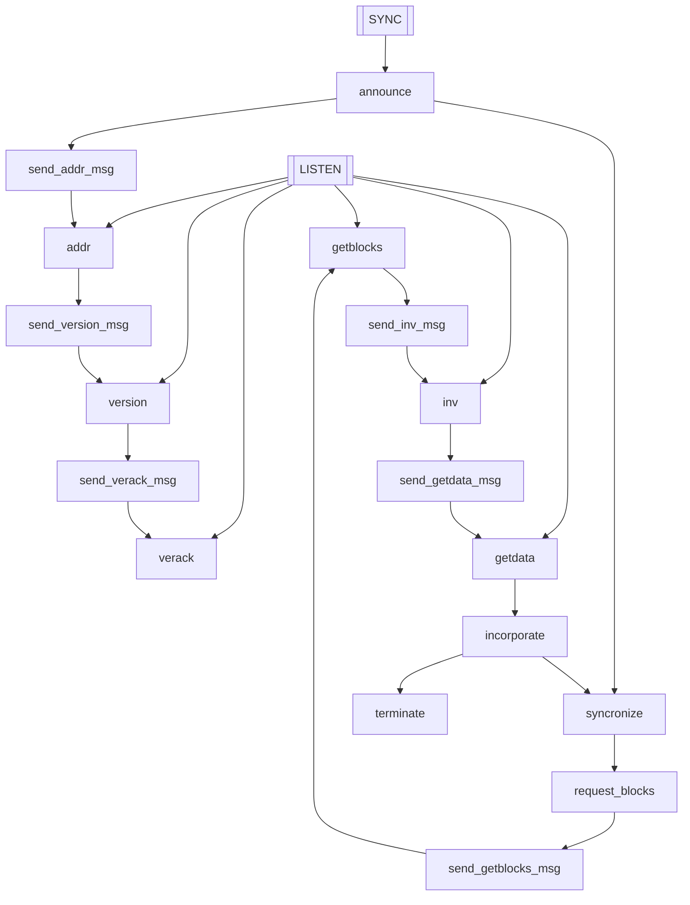

# The Zcash p2p network

### The LISTEN process

```mermaid
flowchart TD
LISTEN[[LISTEN]] --> addr
LISTEN --> version
LISTEN --> verack
LISTEN --> getblocks
LISTEN --> inv
LISTEN --> getdata
```

### The SYNC process

```mermaid
flowchart TD
SYNC[[SYNC]] --> announce
announce --> sync
sync --> sync
```

### The system alltogether

```mermaid
flowchart TD
LISTEN[[LISTEN]] --> addr
LISTEN --> version
LISTEN --> verack
LISTEN --> getblocks
LISTEN --> inv
LISTEN --> getdata

SYNC[[SYNC]] --> announce
announce --> send_addr_msg
send_addr_msg --> addr
addr --> send_version_msg
send_version_msg --> version
version --> send_verack_msg
send_verack_msg --> verack

announce --> syncronize
syncronize --> request_blocks
request_blocks --> send_getblocks_msg
send_getblocks_msg --> getblocks
getblocks --> send_inv_msg
send_inv_msg --> inv
inv --> send_getdata_msg
send_getdata_msg --> getdata
getdata --> incorporate
incorporate --> syncronize
incorporate --> terminate
```
