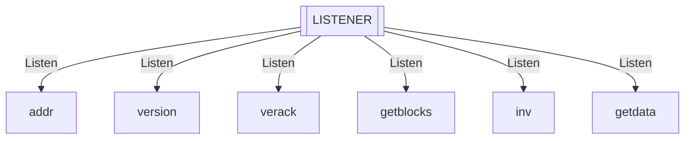
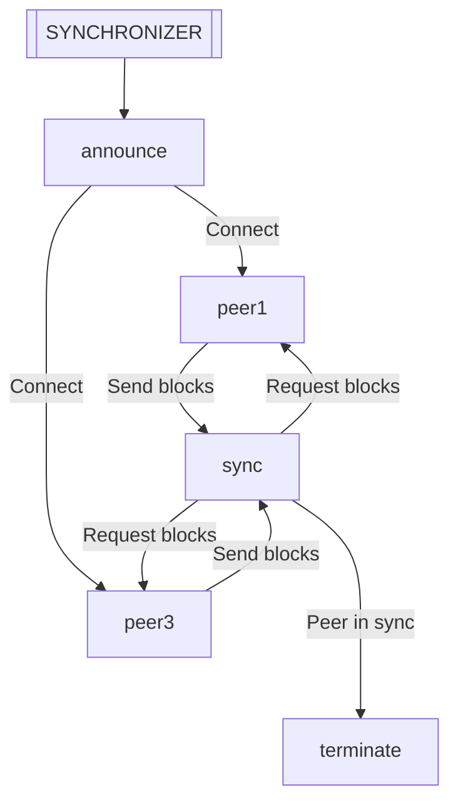
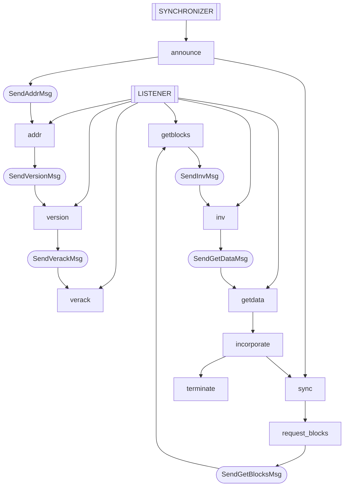
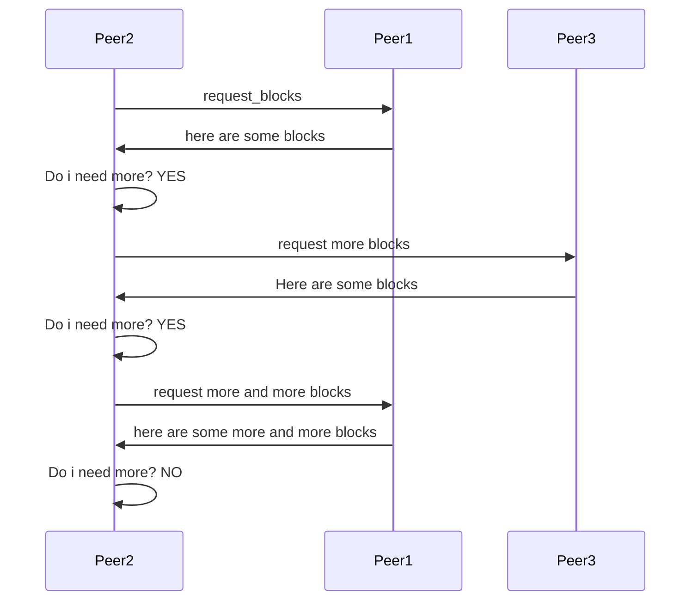

# The Zcash P2P protocol specification

The Zcash P2P protocol is an unspecified system. Inherited from the [Bitcoin P2P](https://developer.bitcoin.org/reference/p2p_networking.html), the Zcash version is a subset of it.

The main role of the P2P protocol is to keep nodes in sync with the network and in order to do so, peers exchange well specified messages.

Peers can be connected to multiple peers, if that is the case, we want to load balance the work with all our peers and download blocks in paralell.

This is what this specification is about.

## Motivation

In general, specs are written to find bugs, this compensates the effort of writing them. However, the main motivations here were not to find bugs but:

- Purely learning purposes, improve TLA+/PlusCal skills.
- Have a better unerstanding how the Zcash P2P protocol works. 

## The project

- [Spec](p2p.tla)
- [PDF]()
- [Blockchain](Blockchain.tla)
- [Operators](Operators.tla)
- [Utils](Utils.tla)

## The model

The model acts according to initial network conditions that are stored in `Blockchain!PEERS`.

....
empty example?

...

### The LISTENER process

This processs just listen for incoming messages and call a procedure when a message arraives to the channel. The followings are the supported messages of this specification.

### The SYNCHRONIZER process

This process creates connections between peers. Connections are created betwen each peer in the `Blockchain!PEER` sequence and the peers each peer has in the `peer_set` sequence field.  After the connection is established, peers will request blocks and try to sync with the network.

The following diagram assumes 3 peers in the network (`peer1`, `peer2` and `peer3`) and that `peer2` has `peer1` and `peer3` in the `peer_set` field it's `Blockchain!PEER` entry.

`SYNCHRONIZER` will not open connections for `peer1` and `peer3` as they don't have peers in the `peer_set`, so, this is what the `SYNCHRONIZER` will do for `peer2`.

### Single peer sync

Let's now assume 2 peers in the network (`peer1` and `peer2`) where `peer1` is in the `peer_set` of `peer2`. Here is how the `SYNCHRONIZER` and the `LISTENER` interact to put `peer2` in sync with `peer1` at a messages level.

### Multi peer sync

Going back to a network of 3 peers (`peer1`, `peer2` and `peer3`) where only the `peer_set` field has peers `peer1` and `peer2` in place.

After connected with both peers, the `SYNCHRONIZER` will request a batch of blocks from `peer1`. As this batch was not enough to be in sync, a next back will be requested from `peer2`, then check again and request more blocks from `peer1` to finally terminate.
 

