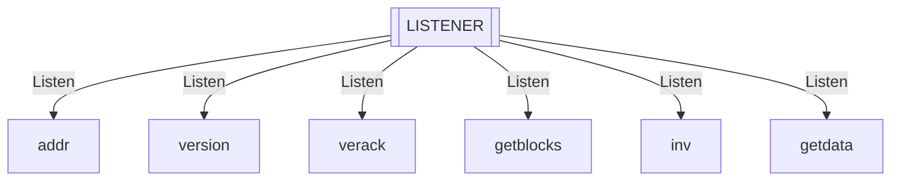
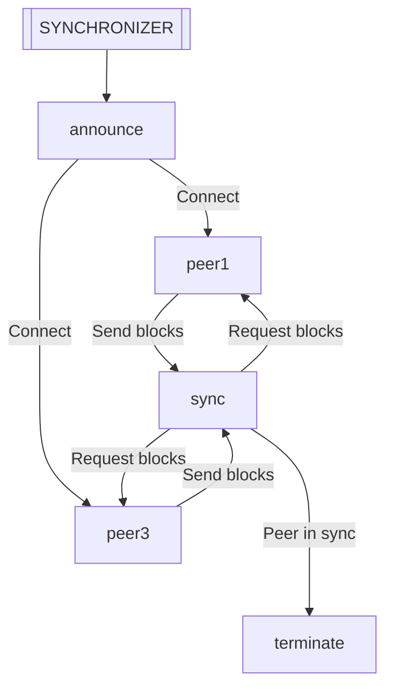
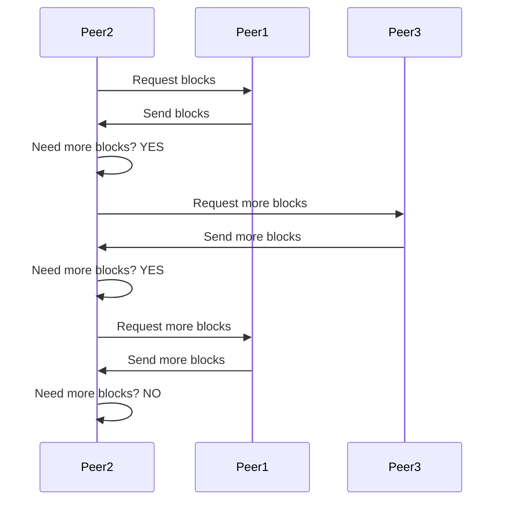

# The Zcash P2P Protocol Specification

The Zcash P2P protocol is a decentralized system, inherited as a subset from the [Bitcoin P2P protocol](https://developer.bitcoin.org/reference/p2p_networking.html). The primary role of this protocol is to keep nodes synchronized with the network. Peers exchange a set of well-defined messages, but the synchronization algorithm is not standardized, allowing for variation in implementations.

This specification describes an approach where peers can connect to multiple other peers, aiming to load balance the workload and download blocks in parallel.

## Motivation

Specifications are typically written to identify and fix bugs, justifying the effort involved. However, the primary motivations for this project are:

- To learn more PlusCal and TLA+.
- To formally define a blockchain synchronization algorithm.

This is an ongoing project, and comments or contributions are highly encouraged.

## Project Structure

The project consists of several files, with `p2p.tla` being the core specification. The algorithm is implemented in PlusCal.

- [Spec](p2p.tla)
- [PDF]()
- [Blockchain](Blockchain.tla)
- [Operators](Operators.tla)
- [Utils](Utils.tla)

## Model Overview

The model operates based on initial network conditions stored in the `Blockchain.tla` module. Variables such as the number of peers, the blocks each peer holds, and the peer set of each peer influence the model's state and behavior during model checking with TLC.

### Running the Model

To run the model, we use the [TLA+ for Visual Studio Code](https://marketplace.visualstudio.com/items?itemName=alygin.vscode-tlaplus) extension, which parses the PlusCal code into TLA+ and allows us to run the TLC model checker.

The Blockchain.tla module includes different initial conditions, labeled as `BLOCKCHAIN1`, `BLOCKCHAIN2`, etc.

In `p2p.tla`, you must update the RunningBlockchain variable to the desired network condition before running the model checker. For example:

```
RunningBlockchain == BLOCKCHAIN5
```

Then, run the TLC model checker against the parsed `p2p.tla` file.

## Internals

The algorithm consists of two processes running in parallel.

### LISTENER process

This process listens for incoming messages and calls the corresponding procedure when a message arrives on the channel established between two connected peers. The following are the supported messages in this specification:



### SYNCHRONIZER process

This process manages connections between peers. Connections are created between each peer listed in the `RunningBlockchain` sequence and their respective peers in the `peer_set`. Once connected, peers will request blocks and attempt to synchronize with the network.

The following diagram assumes a network of three peers (peer1, peer2, and peer3), where peer2 has peer1 and peer3 in its peer_set.

`SYNCHRONIZER` will not open connections for peer1 and peer3 since they have no peers in their `peer_set`. For peer2, connections with peer1 and peer3 will be established, and blocks will be requested from both until peer2 is in sync, at which point the algorithm terminates.



### Single Peer Synchronization

Let's now consider a network with two peers (peer1 and peer2), where peer1 is in the `peer_set` of peer2. The following diagram shows how the `SYNCHRONIZER` and `LISTENER` processes interact to synchronize peer2 with peer1 at the message level.


### Multi-Peer Synchronization

In a network with three peers (peer1, peer2, and peer3), where only peer2 has peers in its `peer_set` (specifically, peer1 and peer3), the following sequence occurs:

After connecting with both peers, the `SYNCHRONIZER` requests a batch of blocks from peer1. If this batch is insufficient for full synchronization, another batch is requested from peer3, and the process repeats until peer2 is fully synchronized.
 

