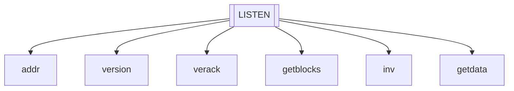
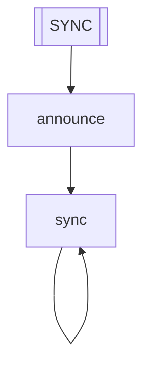
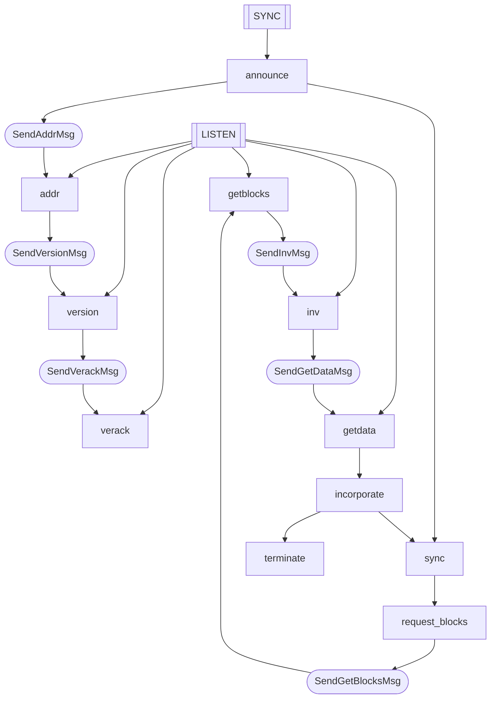

# The Zcash p2p network

### The LISTEN process

This processs just listen for incoming messages and call a procedure when a message arraives to the channel.

### The SYNC process

This process creates connections between the local peer and a remote peer in the local peer set. After the connection is established, the local node start requesting blocks form the remote peer.

### The full system

Both processes are always running, the following flowchart show how the 2 interact with each other.

