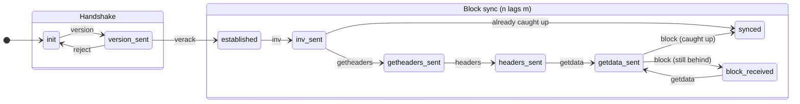

# The Zcash P2P Protocol Specification

A TLA+ formal specification of the Zcash peer-to-peer network protocol, following [ZIP-0204](https://zips.z.cash/zip-0204).

## Structure

- [`messages.tla`](messages.tla) — Message constructors for all protocol messages (`version`, `verack`, `ping`, `pong`, `inv`, `getheaders`, `headers`, `getdata`, `block`).
- [`protocol.tla`](protocol.tla) — Protocol actions, connection state machine, and liveness property.
- [`protocol.cfg`](protocol.cfg) — TLC model checker configuration.

## What is modeled

The spec covers the connection lifecycle between peers:

1. **Handshake** — `version` / `verack` exchange, with non-deterministic rejection (`reject`) to model version validation failures and self-connection detection.
2. **Keepalive** — `ping` / `pong` with nonce echo, triggered when a connection is idle.
3. **Block sync** — `inv` → `getheaders` → `headers` → `getdata` → `block`, looping until the lagging peer catches up.
4. **Disconnection** — peers disconnect if no message is received within `DisconnectTimeout` ticks, then restart the handshake.

Each connection is modeled as an explicit state machine from the perspective of peer **n** tracking its relationship with peer **m**. Any non-`init` state transitions back to `init` on a `Disconnect` (idle timeout), and `ping`/`pong` can fire from any post-handshake state when the connection is idle.


```mermaid
stateDiagram-v2
    direction LR

    [*] --> init

    init --> version_sent : version

    state "Handshake" as hs {
        version_sent --> established : verack
        version_sent --> init : reject
    }

    state "Block sync (n lags m)" as sync {
        established --> inv_sent : inv
        inv_sent --> synced : already caught up
        inv_sent --> getheaders_sent : getheaders
        getheaders_sent --> headers_sent : headers
        headers_sent --> getdata_sent : getdata
        getdata_sent --> block_received : block (still behind)
        block_received --> getdata_sent : getdata
        getdata_sent --> synced : block (caught up)
    }
```

The block sync states are only entered when n has fewer blocks than m. Once n catches up (`synced`), the session for that direction is complete — m independently goes through the same states from its own perspective if it also lags n.

The spec checks:
- **Liveness** — `AllSynced`: eventually all peers reach the same block height.
- **Safety invariants** from ZIP-0204:
  - `InvCountBounded` / `GetDataCountBounded` — inventory vectors carry ≤ 50,000 entries.
  - `HeadersCountBounded` — headers messages carry ≤ 160 headers.
  - `VersionBounded` — peers advertise a version ≥ `MinPeerProtoVersion` (170002).
  - `PingOnEstablished` — ping nonces are only active after the handshake completes.
  - `SyncDirection` — a peer only enters sync states when it actually has fewer blocks than its partner.

## Running the model checker

Requires Java and [`tla2tools.jar`](https://github.com/tlaplus/tlaplus/releases/latest).

Two configurations are provided:

| Config | Peers | Symmetry | Verification |
|---|---|---|---|
| [`protocol.cfg`](protocol.cfg) | 2 | No | Complete — fully explores the state space |
| [`protocol_3peers.cfg`](protocol_3peers.cfg) | 3 | Yes | Bounded — runs until timeout, no errors found |

```bash
# Complete liveness proof (2 peers, finishes in ~3 minutes)
java -jar tla2tools.jar -config protocol.cfg protocol.tla

# Bounded stress test (3 peers, run until timeout)
java -jar tla2tools.jar -config protocol_3peers.cfg protocol.tla
```

### Symmetry reduction

Permuting peer names produces structurally identical states — `peer1={1 block}, peer2={3 blocks}` is the same scenario as `peer1={3 blocks}, peer2={1 block}`. Declaring `SYMMETRY Permutations(InitialPeers)` tells TLC to collapse those equivalence classes, reducing the state space by up to N! (6x for 3 peers).

For symmetry to work, peers must be declared as **model values** (abstract atoms) rather than strings in the config:
```
CONSTANT peer1 = peer1   \* model value
```

**Important caveat:** symmetry reduction is sound for safety properties but can theoretically miss liveness counterexamples (a known TLC limitation). The 2-peer config intentionally omits symmetry to give a complete, trustworthy proof of the `AllSynced` liveness property.

## Generated PDFs

Typeset versions of the spec are available in [`documents/`](documents/):
- [`documents/protocol.pdf`](documents/protocol.pdf)
- [`documents/messages.pdf`](documents/messages.pdf)

PDFs are automatically regenerated by CI on every push to `main` that modifies `.tla` files.

## Configuration

| Constant | Default | Description |
|---|---|---|
| `InitialPeers` | `{"peer1", "peer2"}` | Set of peers in the model. |
| `MaxBlock` | `3` | Maximum initial block height per peer. |
| `MaxClock` | `5` | Upper bound on the clock (limits ping/pong interleaving). |
| `DisconnectTimeout` | `4` | Ticks of silence before a peer disconnects. |
| `MinPeerProtoVersion` | `170002` | Minimum acceptable protocol version (ZIP-0204 §3). |

