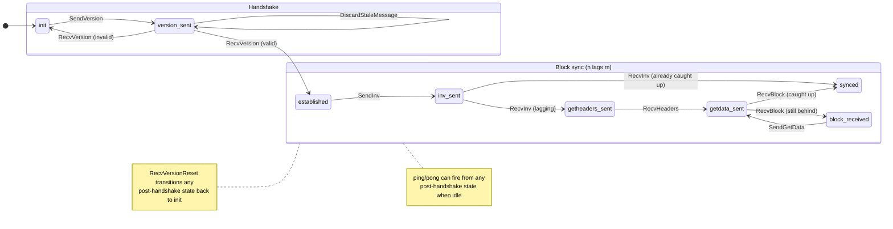
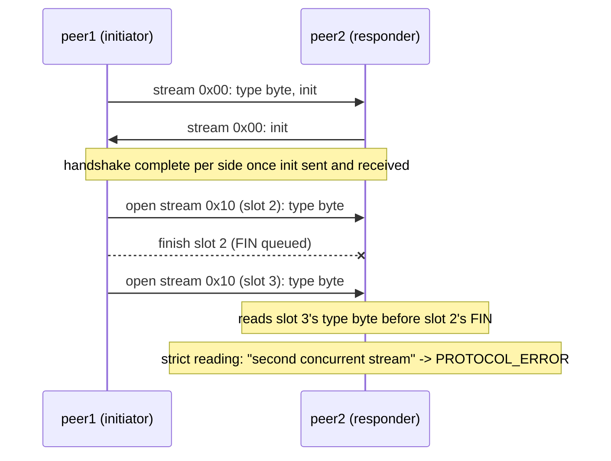

# The Zcash P2P Protocol Specification

A TLA+ formal specification of the Zcash peer-to-peer network protocol, following [ZIP-0204](https://zips.z.cash/zip-0204).

## Structure

- [`messages.tla`](messages.tla) — Message constructors for all protocol messages (`version`, `verack`, `ping`, `pong`, `inv`, `getheaders`, `headers`, `getdata`, `block`, `reject`).
- [`protocol.tla`](protocol.tla) — Protocol actions, connection state machine, and liveness property.
- [`protocol.cfg`](protocol.cfg) — TLC model checker configuration.
- [`sync_scheduler.tla`](sync_scheduler.tla) — Download-scheduler / inventory-routing model that reproduces the Zebra sync stall (see below).

## What is modeled

The spec covers the connection lifecycle between peers using a **message consumption model**.

In a real network, peers communicate only through messages — no node can inspect another node's internal state. The spec enforces this same constraint: each peer has an inbox (FIFO queue) per connection. Sending appends to the remote peer's inbox; receiving dequeues from the local inbox. No action reads remote node variables directly — all decisions are based solely on message payloads. This means that any property the model checker verifies holds under the same information constraints that real implementations face.

1. **Handshake** — `version` / `verack` exchange. Version validation is deterministic: peers whose advertised version is below `MinPeerProtoVersion` are rejected.
2. **Keepalive** — `ping` / `pong` with nonce echo, triggered when a connection is idle.
3. **Block sync** — `inv` → `getheaders` → `headers` → `getdata` → `block`, looping until the lagging peer catches up. Both peers exchange invs before either processes the other's.
4. **Disconnection** — unilateral (TCP FIN): if no message is received within `DisconnectTimeout` ticks, the detecting side resets to `init` and the TCP pipe is torn down. The remote peer discovers the disconnection independently via its own timeout. Stale messages from the old connection are discarded during the new handshake, and unexpected version messages on a post-handshake connection trigger a reset — matching [Zebra](https://github.com/ZcashFoundation/zebra)'s `DuplicateHandshake` behavior.

Each connection is modeled as an explicit state machine from the perspective of peer **n** tracking its relationship with peer **m**. Ping/pong can fire from any post-handshake state when the connection is idle.


```mermaid
stateDiagram-v2
    direction LR

    [*] --> init

    init --> version_sent : SendVersion

    state "Handshake" as hs {
        version_sent --> established : RecvVersion (valid)
        version_sent --> init : RecvVersion (invalid)
        version_sent --> version_sent : DiscardStaleMessage
    }

    state "Block sync (n lags m)" as sync {
        established --> inv_sent : SendInv
        inv_sent --> synced : RecvInv (already caught up)
        inv_sent --> getheaders_sent : RecvInv (lagging)
        getheaders_sent --> getdata_sent : RecvHeaders
        getdata_sent --> block_received : RecvBlock (still behind)
        block_received --> getdata_sent : SendGetData
        getdata_sent --> synced : RecvBlock (caught up)
    }

    note right of sync
        ping/pong can fire from any
        post-handshake state when idle
    end note

    note left of sync
        RecvVersionReset transitions any
        post-handshake state back to init
    end note
```

The block sync states are only entered when n has fewer blocks than m (determined from the inv payload). Once n catches up (`synced`), the session for that direction is complete — m independently goes through the same states from its own perspective if it also lags n.

The spec checks:
- **Liveness** — `EventualConsensus`: eventually all peers reach the same block height.
- **Safety invariants** from ZIP-0204:
  - `InvCountBounded` / `GetDataCountBounded` — inventory vectors carry ≤ 50,000 entries.
  - `HeadersCountBounded` — headers messages carry ≤ 160 headers.
  - `VersionBounded` — peers advertise a version ≥ `MinPeerProtoVersion` (170002).
  - `PingOnEstablished` — ping nonces are only active after the handshake completes.
  - `SyncDirection` — a peer only enters sync states when it has ≤ blocks than its partner.

## What is not modeled

- **Peer discovery** — the spec assumes a fixed set of peers (`InitialPeers`) that already know about each other. DNS seed lookups, `addr`/`getaddr` message exchange, and dynamic peer set changes are not included. Peer discovery is orthogonal to the connection-level protocol — it determines *who* you connect to, not *how* the connection behaves once established. Excluding it keeps the state space focused on the properties we want to verify (handshake correctness, sync convergence, keepalive bounds). See [#2](https://github.com/oxarbitrage/zcash-p2p-spec/issues/2) for discussion.

## Sync scheduler (download-pipeline stall)

[`sync_scheduler.tla`](sync_scheduler.tla) models the layer *above* the per-connection
protocol: the inventory-routing registry and block-download scheduler that pick *which*
peer to ask for each block. This is where Zebra's genesis-to-tip sync stall lived
([ZcashFoundation/zebra#10679](https://github.com/ZcashFoundation/zebra/pull/10679),
symptom [#5709](https://github.com/ZcashFoundation/zebra/issues/5709)). Two boolean
constants select Zebra's pre- and post-fix behaviour, and the model reproduces the stall
as a TLC counterexample under the buggy behaviour while satisfying both safety and
liveness under the fix.

| Config | Behaviour | Checks | Expected |
|---|---|---|---|
| [`sync_scheduler_fixed.cfg`](sync_scheduler_fixed.cfg) | fixed | invariants + liveness | passes |
| [`sync_scheduler_buggy.cfg`](sync_scheduler_buggy.cfg) | buggy | `EventuallyAllVerified` | **violated** (the stall) |
| [`sync_scheduler_poison.cfg`](sync_scheduler_poison.cfg) | buggy | `RegistryHonest` | **violated** (timeout ≠ notfound) |

```bash
java -jar tla2tools.jar -config sync_scheduler_fixed.cfg  sync_scheduler.tla  # passes
java -jar tla2tools.jar -config sync_scheduler_buggy.cfg  sync_scheduler.tla  # liveness stall
java -jar tla2tools.jar -config sync_scheduler_poison.cfg sync_scheduler.tla  # registry poisoning
```

Full write-up: [`documents/sync-stall-modeling.md`](documents/sync-stall-modeling.md).

## Version 2 protocol (draft ZIP, QUIC streams)

The [`v2/`](v2/) directory models the successor protocol proposed in
[zcash/zips#1344](https://github.com/zcash/zips/pull/1344) — the draft whose
`Formal Model` section cites this repository. The draft replaces the TCP message
pipe with QUIC typed streams: an `init` handshake on a dedicated stream, one
bidirectional stream per request, and long-lived unidirectional announcement
streams. The legacy model above is unchanged; the draft is pinned at revision
`a3f4fa2a` (see [`documents/v2-modeling.md`](documents/v2-modeling.md)).

- [`v2/streams.tla`](v2/streams.tla) — the stream layer: one FIFO **per stream**
  instead of one inbox per connection, so the transport's "streams are mutually
  independent" guarantee is modeled as free reordering across streams. FIN is a
  queue sentinel; RESET_STREAM and STOP_SENDING are flags that can overtake data.
- [`v2/records.tla`](v2/records.tla) — `init`, header-announcement, `get-headers`
  and `get-blocks` records.
- [`v2/protocol.tla`](v2/protocol.tla) — connection setup, the `init` handshake
  with version negotiation, block announcement streams, and headers-first
  synchronization over `get-headers` / `get-blocks` request streams (one
  request and its response per bidirectional stream; the responder may answer
  before the requester's FIN and may finish after any complete entry).


```mermaid
sequenceDiagram
    participant A as peer1 (initiator)
    participant B as peer2 (responder)
    A->>B: stream 0x00: type byte, init
    B->>A: stream 0x00: init
    Note over A,B: handshake complete per side once init sent and received
    A->>B: open stream 0x10 (slot 2): type byte
    A--xB: finish slot 2 (FIN queued)
    A->>B: open stream 0x10 (slot 3): type byte
    Note over B: reads slot 3's type byte before slot 2's FIN
    Note over B: strict reading: "second concurrent stream" -> PROTOCOL_ERROR
```

Two boolean constants select the receiver's reading of the draft:
`StrictSingleton` (a second open announcement stream of a type is a
`PROTOCOL_ERROR`, the literal text) and `RefusePreHandshake` (announcement
streams arriving before the local handshake completes are refused with
`REFUSED` rather than buffered).

| Config | Focus | Checks | Expected |
|---|---|---|---|
| [`v2/protocol.cfg`](v2/protocol.cfg) | headers-first sync, 3-block chain | invariants + `EventualConsensus` | passes (complete, ~330k states) |
| [`v2/protocol_restart.cfg`](v2/protocol_restart.cfg) | announcement stream finish/reset + replacement | invariants + liveness | passes (complete, ~1.4M states) |
| [`v2/protocol_refuse.cfg`](v2/protocol_refuse.cfg) | refuse streams that arrive pre-handshake | invariants + liveness | passes (complete) |
| [`v2/protocol_obsolete.cfg`](v2/protocol_obsolete.cfg) | a peer may be below `MinVersion` | invariants + liveness | passes (`OBSOLETE` only) |
| [`v2/protocol_strict.cfg`](v2/protocol_strict.cfg) | strict singleton reading | `NoHonestProtocolError` | **violated** (replacement race) |
| [`v2/protocol_3peers.cfg`](v2/protocol_3peers.cfg) | 3 peers, symmetry | invariants | bounded, no error |

Safety invariants cover the draft's connection rules (one handshake stream,
nothing before `init`, negotiated version is the minimum, one announcement
stream per type, one request per stream after the handshake, response bounds,
contiguous headers) plus `NoHonestProtocolError` and `NoHonestPenalty`: with no
adversarial actions in the model, no close other than `OBSOLETE` and no
misbehavior points ever occur.

```bash
cd v2
java -jar ../tla2tools.jar -config protocol.cfg        protocol.tla   # passes
java -jar ../tla2tools.jar -config protocol_strict.cfg protocol.tla   # NoHonestProtocolError violated
```

The strict counterexample is a 12-state trace in which every step is a
MAY-sanctioned action: a sender finishes its announcement stream, opens the
replacement the draft allows, and the receiver consumes the replacement's type
byte before the old stream's FIN. Zebra's draft implementation applies the
strict reading on receive (its own sender never triggers it). Write-up and
proposed draft wording: [`documents/v2-modeling.md`](documents/v2-modeling.md),
[`documents/v2-spec-feedback.md`](documents/v2-spec-feedback.md).

## Running the model checker

Requires Java and [`tla2tools.jar`](https://github.com/tlaplus/tlaplus/releases/latest).

Two configurations are provided:

| Config | Peers | Symmetry | Verification |
|---|---|---|---|
| [`protocol.cfg`](protocol.cfg) | 2 | No | Complete — fully explores the state space |
| [`protocol_3peers.cfg`](protocol_3peers.cfg) | 3 | Yes | Bounded — runs until timeout, no errors found |

```bash
# Complete liveness proof (2 peers, finishes in ~10 seconds)
java -jar tla2tools.jar -config protocol.cfg protocol.tla

# Bounded stress test (3 peers, run until timeout)
java -jar tla2tools.jar -config protocol_3peers.cfg protocol.tla
```

### Symmetry reduction

Permuting peer names produces structurally identical states — `peer1={1 block}, peer2={3 blocks}` is the same scenario as `peer1={3 blocks}, peer2={1 block}`. Declaring `SYMMETRY Permutations(InitialPeers)` tells TLC to collapse those equivalence classes, reducing the state space by up to N! (6x for 3 peers).

For symmetry to work, peers must be declared as **model values** (abstract atoms) rather than strings in the config:
```
CONSTANT peer1 = peer1   \* model value
```

**Important caveat:** symmetry reduction is sound for safety properties but can theoretically miss liveness counterexamples (a known TLC limitation). The 2-peer config intentionally omits symmetry to give a complete, trustworthy proof of the `EventualConsensus` liveness property.

## Generated PDFs

Typeset versions of the spec are available in [`documents/`](documents/):
- [`documents/protocol.pdf`](documents/protocol.pdf)
- [`documents/messages.pdf`](documents/messages.pdf)
- [`documents/sync_scheduler.pdf`](documents/sync_scheduler.pdf)
- [`documents/v2-protocol.pdf`](documents/v2-protocol.pdf), [`documents/v2-streams.pdf`](documents/v2-streams.pdf), [`documents/v2-records.pdf`](documents/v2-records.pdf)

PDFs are automatically regenerated by CI on every push to `main` that modifies `.tla` files.

## Configuration

| Constant | Default | Description |
|---|---|---|
| `InitialPeers` | `{"peer1", "peer2"}` | Set of peers in the model. |
| `MaxBlock` | `3` | Maximum initial block height per peer. |
| `MaxClock` | `5` | Upper bound on the clock (limits ping/pong interleaving). |
| `DisconnectTimeout` | `4` | Ticks of silence before a peer disconnects. |
| `MinPeerProtoVersion` | `170002` | Minimum acceptable protocol version (ZIP-0204 §3). |
